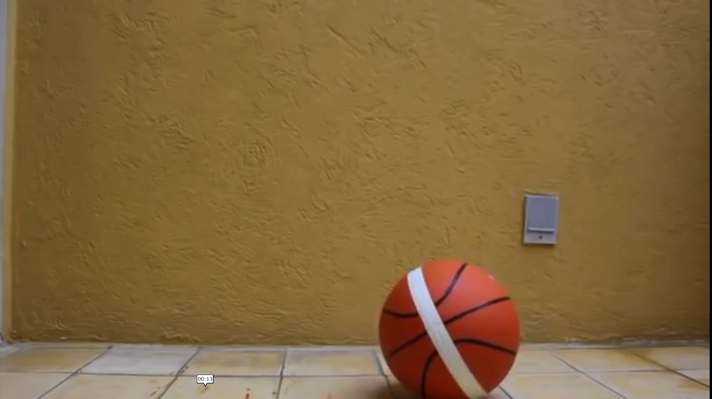
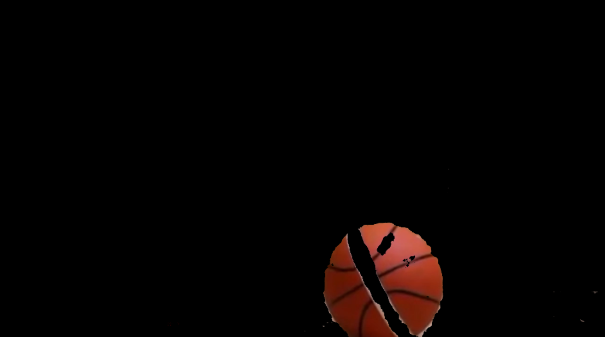

# Image-Tracking-Project

Object Tracking project with MeanShift & CamShift for Image analisis class at UIB

## Overview
This project focuses on object tracking using OpenCV’s MeanShift and CamShift algorithms. It tracks a moving ball in a video by leveraging color-based tracking techniques. The project includes:

1. Color-based tracking with HSV thresholding.
2. MeanShift & CamShift tracking algorithms.
3. Contour detection as a fallback for lost tracking.

This approach has applications in sports analytics, motion detection, and surveillance systems.

## Video
Input Video is a basket ball bouncing facing different orientation on direction to the camera

Mask Applied for Color Detection

Installation
Clone the repository:
bash
Copiar
`git clone https://github.com/yourusername/Object-Tracking-MeanShift-CamShift.git`

`cd Object-Tracking-MeanShift-CamShift`

Usage
All code can be found on `Main.py`

This script:
✅ Loads the video file.
✅ Allows the user to select an ROI (Region of Interest).
✅ Applies MeanShift / CamShift tracking.
✅ Uses contour detection if the ball is lost.

It starts by manually selecting the mask with the use of cvzone libreary where:
✅ Detects the ball based on HSV color filtering.
✅ Uses cvzone for better contour detection.

Algorithm Choice
Why MeanShift & CamShift?
MeanShift is a non-parametric iterative algorithm that moves a tracking window to the densest region of pixels based on color histograms.
CamShift (Continuously Adaptive MeanShift) enhances MeanShift by dynamically resizing the tracking window.

🚀 Advantages:
✔ Does not require training (no deep learning needed).
✔ Fast & efficient for real-time tracking.
✔ Adaptive to object shape changes (with CamShift).

## 🚧 Challenges:

**General limitations:**
* Sensitive to lighting changes and occlusion.
* Can lose track if the object splits into multiple regions.

**Specific challenges in This Project:**

1.Ball Design Issue. The ball has a white stripe, making it appear as two separate objects. This confuses the algorithm, causing tracking failures.

2. Discontinuous Video. The video is a compilation of different ball clips. The ball disappears out of frame multiple times.

Solution: Implement contour-based recovery when tracking fails.
Future Improvements
🚀 Enhancements to consider:

Adjust threshold for object detection
Improve handling of occlusions and lighting changes.
Dependencies
Ensure you have the following installed:

`
numpy
opencv-python
cvzone`

Authors
* Alejandro Cedillo
* Irving Perez
